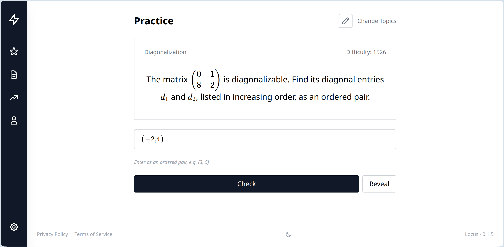

# Locus

Competitive math learning platform. Solve problems, earn ELO ratings, climb leaderboards. Problems graded symbolically via SymEngine CAS — runs both client-side (WASM) and server-side (native).

**Live at [locusmath.org](https://locusmath.org)**

<p align="center">
  <a href="https://locusmath.org">
    
  </a>
</p>

## Features

- **Symbolic grading** — SymEngine CAS checks mathematical equivalence, not string matching
- **12 answer types** — Expressions, equations, inequalities, intervals, sets, tuples, matrices, and more
- **Per-topic ELO** — Track skill across 10+ math topics from arithmetic to differential equations
- **Practice + ranked modes** — Untimed practice with solutions, or ranked with ELO stakes
- **Client-side grading** — Instant feedback via WASM before server confirmation
- **DSL problem generation** — AI writes YAML descriptions, Rust parser handles all computation and LaTeX
- **OAuth** — Google and GitHub login

## Tech Stack

| Layer | Technology |
|---|---|
| Frontend | Leptos 0.8 (Rust → WASM, CSR) |
| Backend | Axum (Rust) |
| Database | PostgreSQL 16 |
| CAS | SymEngine (WASM + native FFI) |
| Math input | MathQuill + KaTeX |
| Auth | JWT + Argon2 + OAuth |
| Problem gen | LocusDSL (Rust) + Claude API |
| Deployment | Docker, Kubernetes (Helm), Cloudflare |

## Quick Start

```bash
# Prerequisites: cargo, trunk, cargo-watch, docker
git clone https://github.com/FizzWizZleDazzle/locus.git
cd locus
./dev.sh    # Starts DB (5433), backend (3000), frontend (8080)
```

## Problem Generation

Problems are defined in YAML — AI describes math, Rust does all computation:

```yaml
topic: calculus/derivative_rules
difficulty: medium

variables:
  a: nonzero(-8, 8)
  n: integer(2, 6)
  f: a * x^n
  answer: derivative(f, x)

question: "Find {derivative_of(f, x)}"
answer: answer
```

No LaTeX, no code. Parser handles sampling, SymEngine evaluation, LaTeX rendering, self-grading.

```bash
# Generate problems from YAML
cargo run --bin dsl-cli -- generate problems/calculus/derivative_rules.yaml -n 10

# AI-generate new YAML files (concurrent)
cargo run --bin dsl-cli -- ai "algebra1/quadratic_formula" -n 20 -j 5 -o problems/algebra1/

# Validate all problem files
cargo run --bin dsl-cli -- validate problems/
```

See [`docs/DSL_SPEC.md`](docs/DSL_SPEC.md) for the full DSL reference.

## Project Structure

```
crates/
  common/       Shared types, SymEngine FFI, grading, KaTeX validation
  dsl/          LocusDSL parser (YAML → problems)
  dsl-cli/      CLI for problem generation + AI pipeline
  frontend/     Leptos WASM app
  backend/      Axum REST API
problems/       YAML problem definitions (organized by topic)
docs/           Architecture, API, database, deployment docs
helm/           Kubernetes Helm charts
```

## Documentation

- [`docs/DSL_SPEC.md`](docs/DSL_SPEC.md) — Problem generation DSL reference
- [`docs/ARCHITECTURE.md`](docs/ARCHITECTURE.md) — Crate map, grading system, build system
- [`docs/API.md`](docs/API.md) — HTTP endpoint reference
- [`docs/DATABASE.md`](docs/DATABASE.md) — Schema, migrations, functions
- [`docs/DEPLOYMENT.md`](docs/DEPLOYMENT.md) — Environment variables, Docker, Kubernetes
- [`CONTRIBUTING.md`](CONTRIBUTING.md) — How to contribute problems and code

## Contributing

The easiest way to contribute is writing problem YAML files. See [`CONTRIBUTING.md`](CONTRIBUTING.md).

## License

[GPL-3.0](LICENSE)
